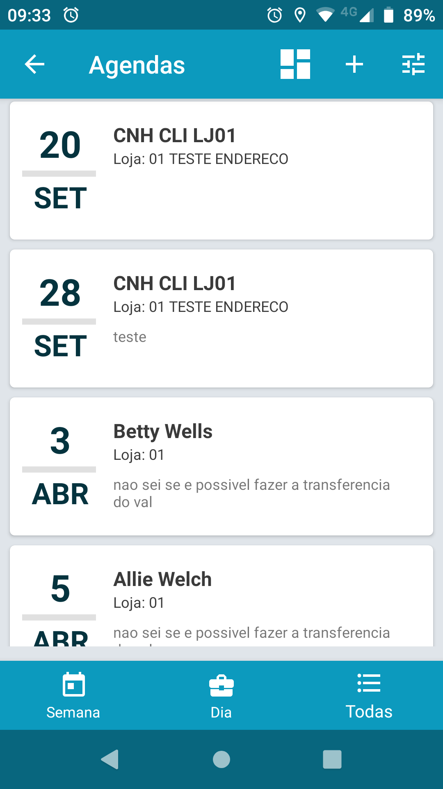
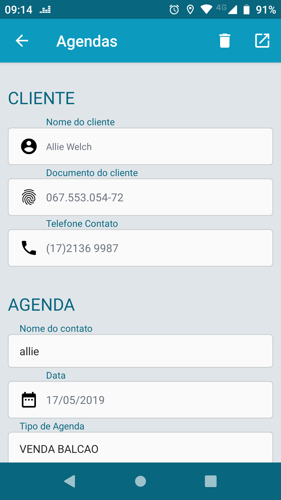
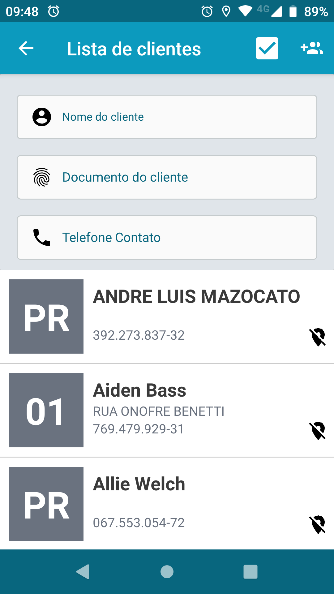
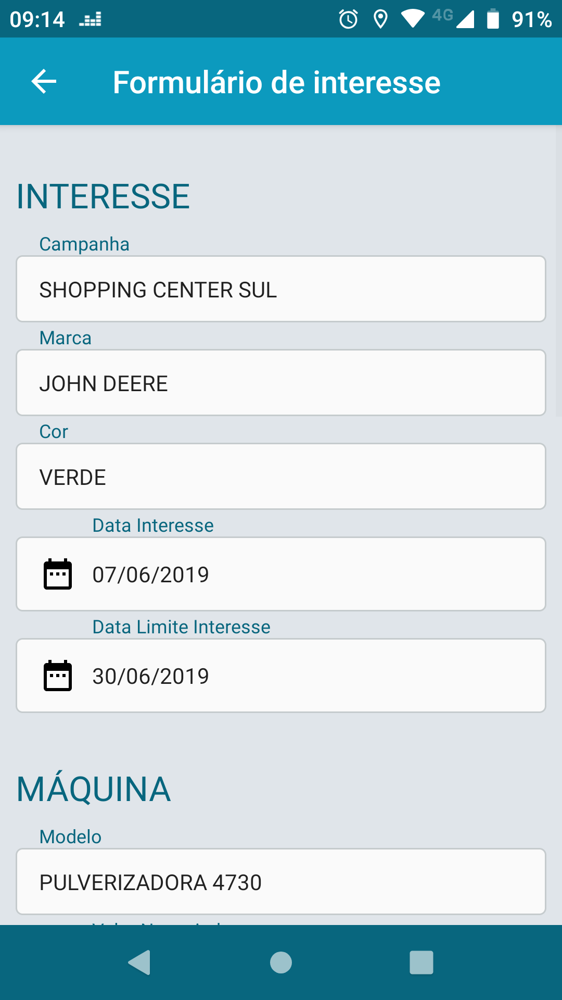
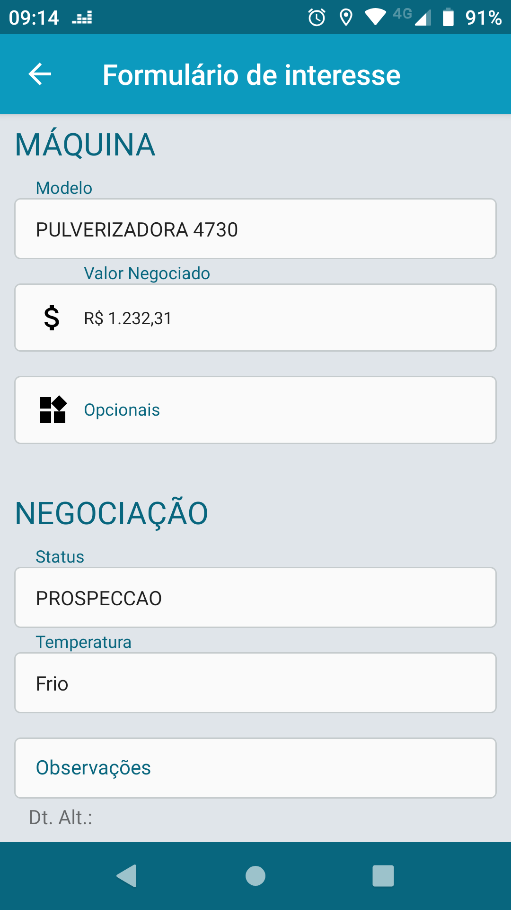
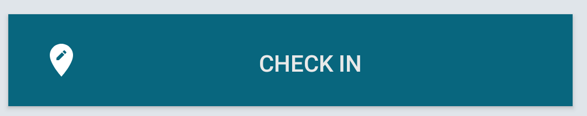

## CEV Mobile

Bem vindo, este guia vai te ajudar a entender e trabalhar com o aplicativo [Cev Mobile](https://play.google.com/store/apps/details?id=itmil.mil_mobile)

O Cev Mobile é um aplicativo criado para que o CRM de DMS da TOTVS possa ser utilizado com maior facilidade e menos dificuldade pelos colaboradores diretamente associados com o atendimento ao cliente. Como ele funciona offline também é possível sua utilização fora de ambiente com conexão o que resolve o problema em caso de fazendas ou áreas afastadas onde não existe rede celular.

Para sua utilização basta que o usuário tenha em mãos o endereço do webservice de integração com protheus e o entendimento geral de sua utilização

### Início

Ao abrir o aplicativo você vai se deparar com a tela principal, nela abra o menu para fazer a configuração inicial, no menu procure `Configurações` nela você deverá colocar o endereço do webservice, porta e seu CPF e clique em salvar, caso não saiba o endereço ou porta do webservice entre em contato com o responsável de TI.

Agora vá para o menu novamente, clique em `Sincronizar`, nela clique no botão `Sincronizar` e você deverá ver que uma nova linha será adicionada acima dos botões e um percentual será apresentado. Caso este comportamento não aconteça possívelmente sua configuração está errada.

Caso algum erro aconteça você pode verificar clicando na linha do percentual, alguns erros de timeout podem acontecer e são até normais dependendo da sua conexão com a internet, caso ocorram você pode sempre tentar novamente fazer a sincronização.

### Agendas

A `Agenda` é a entidade que representa um contato com o cliente, nela você deve registrar todos os contatos, as conversas e os detalhes referentes a negociações, quanto mais detalhes melhor para o negócio.

Para registrar uma agenda entra no `Menu` depois `Agendas`, nele você verá o dashboard.

Nesta tela você pode separar as agendas em agendas da `Semana`, Do `Dia` ou `Todas`, acima pode ser feito um filtro ver as agendas por semana ou no `+` onde podemos criar uma nova agenda.

Ao clicar no `+` você verá a seguinte janela:

### Oportunidades

As `Oportunidades` são o registro principal de vendas de máquinas ou veículos, esta entidade vai te ajudar a organizar e controlar as negociações com o cliente até a venda efetiva do produto.

Para registrar uma oportunidade vá ao `Menu` depois `Oportunidades`, na tela apresentada você terá uma lista de clietes e prospects com um filtro e um menu superior.

No menu superior verá um checkbox que filtra os clientes entre os que possuem oportunidades e os que não possuem. No ícone de `+` você poderá criar um prospect com os dados digitados nos campos `Nome, Documento e Telefone` e adicionar uma oportunidade ao mesmo.

Escolhendo um cliente ou criando um prospect o formulário de oportunidades será apresentado, nele você vai poder cadastrar sua oportunidade de negócio.

Lembrando que uma oportunidade pode conter mais de 1 interesse.

### Raic

Os `Raics` são os registros de satisfação ou insatisfação com o cliente, entrando em `Menu` depois `RAIC` será possível registrar uma satisfação ou insatisfação para um cliente.

Prospects não podem ter `RAICS`

### Mapeamento GPS de Clientes

Em algumas telas você verá botões e ícones representando se o cliente possui um mapeamento GPS em seu cadastrou ou não.

Caso o ícone  seja apresentado, significa que o cliente está sem mapeamento de GPS para a loja.

Para mapear uma loja ou fazenda de um cliente vá em `Menu` depois `Clientes` procure o cliente e nos detalhes você verá um botão de `check in` ao clicar no mesmo ele vai coletar as coordenadas e gravar no cliente, sendo assim na próxima sincronização o cliente agora será um cliente mapeado.

Também é possível mapear o cliente pela tela de oportunidades botão checkin no menu superior.

### Sincronização

No `Menu` `Sincronizar` repare que existem 2 botões, `SINCRONIZAR` e `RÁPIDA` a diferença das duas consiste na quantidade de dados que será recebido e enviado entre celular e webservice de integração.

A sincronização completa busca todos os dados para trabalho com celular e pode ser bem demorada pois trafega todos os clientes, modelos, oportunidades do celular.

A sincronização rápida somente envia os dados que foram alterados no celular para o webservice de integração, é bem mais rápido e recomendado caso esteja em uma rede lenta 3G.

Embora seja possível sempre usar a sincronização rápida alguns dados precisam de sincronização completa de tempos em tempos, como por exemplo os modelos vendidos que podem ser incluídos novos, mapeamentos GPS de clientes, etc.

